**Digital transformation through software, AI, automation, web, SEO, ERP & SaaS.**

[Website](https://www.jazaritech.com) · [GitHub](https://github.com/jazaritech-official)

<!-- About Heading -->

Jazari Tech is a technology company based in Karachi, Pakistan. We build digital solutions that help businesses attract customers, operate more efficiently, and scale.

<!-- What We Build Heading -->

<!-- Actual Content where built projects exist -->

<!-- Technology Stack Heading -->

<!-- Featured Projects -->

<!-- Actual Content where Featured Projects exist -->

[Official-Website](https://github.com/jazaritech-official/Official-Website) · [EWE_School](https://github.com/jazaritech-official/EWE_School)

<!-- Engineering Standards -->

- TypeScript-first, maintainable codebases
- Peer review through pull requests
- Documented, reproducible setups

<!-- Security -->

- No secrets committed to repositories
- Private repositories for internal systems
- Least-privilege access for the team

<!-- Development Workflow -->

`Plan` → `Build` → `Review` → `Test` → `Deploy` with GitHub Actions

<!-- Mission & Vision -->

**Mission:** Turn technology into practical business outcomes by building digital systems that help organizations attract customers, operate smarter, and scale sustainably.

**Vision:** Become a trusted technology partner for businesses building the next generation of digital products, automated operations, and intelligent systems.

<!-- Connect -->

🌐 [jazaritech.com](https://www.jazaritech.com) · 📍 Karachi, Sindh, Pakistan
